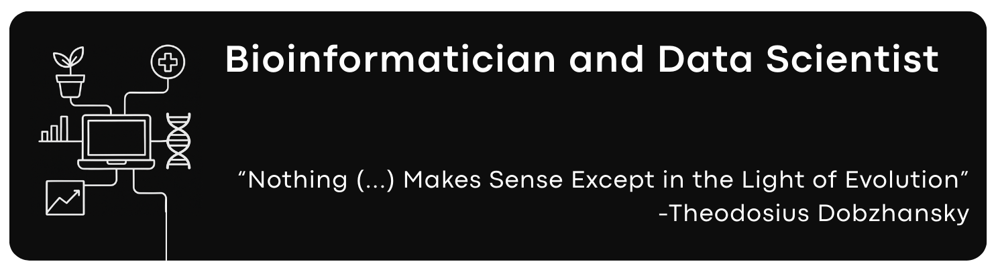

# Hi there, I'm Alexandre J. Borges 👋
I have a degree in Biology from [Federal University of Uberlândia.](https://ufu.br)  
MBA in Data Science and Analytics and a Master’s degree in Biotechnology at the [University of São Paulo.](https://www5.usp.br)  
PhD candidate to Biotechnology at the [University of São Paulo.](https://www5.usp.br)

I'm currently applying statistical analysis and machine learning to develop predictive models that generate valuable insights and drive business growth.   

Here are some research projects I was involved in:  

## Hard Skill set 💪
**Programming Languages**  
	 

**Libraries**  
      

**Database strutcture**  
 

**Data Business Plataform**  
 

**Cloud**  
 

##
I'm very enthusiastic about meeting people and working on diverse projects. Let's connect!  
 
